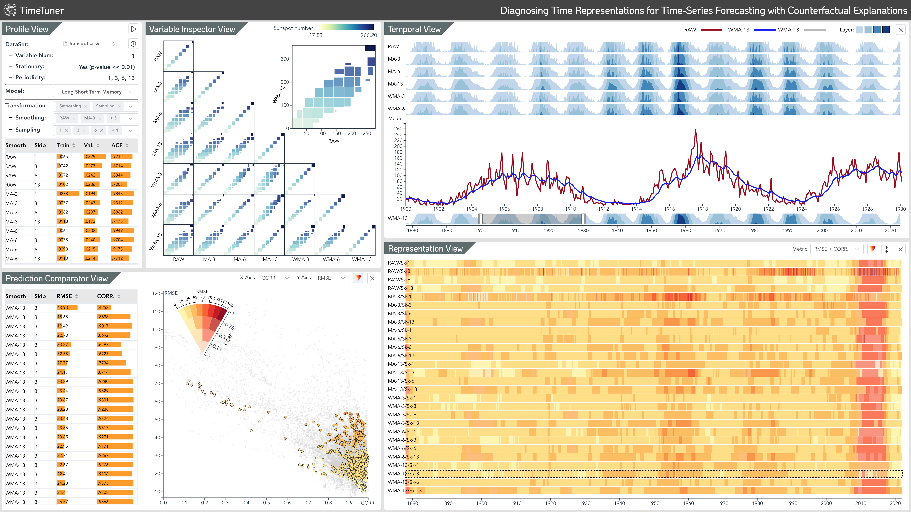

<!--
 * @Description: 
 * @Author: Qing Shi
 * @Date: 2023-07-02 15:42:55
 * @LastEditors: Qing Shi
 * @LastEditTime: 2023-07-16 16:15:09
-->
<!-- # TimeTuner - Diagnosing Time Representations for Time-Series Forecasting with Counterfactual Explanations



### Summary:
**TimeTuner** is a general visual analytics framework. which is designed to help analysts understand how model behaviors are associated with localized correlations, stationarity, and granularity of time-series representations. 
In our work, we instantiate TimeTuner with two transformation methods of smoothing and sampling, and demonstrate its applicability  on real-world time-series forecasting of univariate sunspots and multivariate air pollutants.

### Dependencies
The following environments and packages are required to run this project:
- **backend:**
  - Python: version 3.8 or higher
  - SHAP: version 0.41.0
  - pandas: version 1.5.3
  - tensorflow: version 2.10.0
  - keras: version 2.10.0
  - scikit-learn: version 1.2.2
  - numpy: version 1.24.3
  - Flask: version 2.2.0
- **frontend:**
  - Vue.js 3
  

Make sure to have Python 3.8 or higher version installed before proceeding with the packages installation.

### Recommended IDE Setup
[VSCode](https://code.visualstudio.com/) + [Python 3.9](https://www.python.org/downloads/release/python-390/) + [Flask 2.2](https://flask.palletsprojects.com/en/2.2.x) + [Volar](https://marketplace.visualstudio.com/items?itemName=Vue.volar) (and disable Vetur) + [TypeScript Vue Plugin (Volar)](https://marketplace.visualstudio.com/items?itemName=Vue.vscode-typescript-vue-plugin). -->

<!-- Improved compatibility of back to top link: See: https://github.com/othneildrew/Best-README-Template/pull/73 -->
<a name="readme-top"></a>
<!--
*** Thanks for checking out the Best-README-Template. If you have a suggestion
*** that would make this better, please fork the repo and create a pull request
*** or simply open an issue with the tag "enhancement".
*** Don't forget to give the project a star!
*** Thanks again! Now go create something AMAZING! :D
-->


<!-- PROJECT SHIELDS -->
<!--
*** I'm using markdown "reference style" links for readability.
*** Reference links are enclosed in brackets [ ] instead of parentheses ( ).
*** See the bottom of this document for the declaration of the reference variables
*** for contributors-url, forks-url, etc. This is an optional, concise syntax you may use.
*** https://www.markdownguide.org/basic-syntax/#reference-style-links
-->
<!-- [![Contributors][contributors-shield]][contributors-url]
[![Forks][forks-shield]][forks-url]
[![Stargazers][stars-shield]][stars-url]
[![Issues][issues-shield]][issues-url]
[![MIT License][license-shield]][license-url]
[![LinkedIn][linkedin-shield]][linkedin-url] -->


<!-- PROJECT LOGO -->
<br />
<div align="center">
  <!-- <a href="https://github.com/othneildrew/Best-README-Template">
    
  </a> -->

  <h1 align="center">TimeTuner:  Diagnosing Time Representations for Time-Series Forecasting with Counterfactual Explanations</h1>

  <p align="center">
    <!--
    <br /> -->
    <!-- <br /> -->
    <a href="https://catherinehao.github.io/TimeTuner/">Homepage</a>
    ·
    <a href="https://arxiv.org/abs/2307.09916">Paper</a>
    ·
    <a href="https://github.com/CatherineHao/TimeTuner">Code</a>
  </p>
</div>


<!-- TABLE OF CONTENTS -->
<!-- <details>
  <summary>Table of Contents</summary>
  <ol>
    <li>
      <a href="#about-the-project">About The Project</a>
      <ul>
        <li><a href="#built-with">Built With</a></li>
      </ul>
    </li>
    <li>
      <a href="#getting-started">Getting Started</a>
      <ul>
        <li><a href="#prerequisites">Prerequisites</a></li>
        <li><a href="#installation">Installation</a></li>
      </ul>
    </li>
    <li><a href="#usage">Usage</a></li>
    <li><a href="#roadmap">Roadmap</a></li>
    <li><a href="#contributing">Contributing</a></li>
    <li><a href="#license">License</a></li>
    <li><a href="#contact">Contact</a></li>
    <li><a href="#acknowledgments">Acknowledgments</a></li>
  </ol>
</details> -->


<!-- ABOUT THE PROJECT -->
## Abstract

**TimeTuner** is a general visual analytics framework. which is designed to help analysts understand how model behaviors are associated with localized correlations, stationarity, and granularity of time-series representations. 
In our work, we instantiate TimeTuner with two transformation methods of smoothing and sampling, and demonstrate its applicability  on real-world time-series forecasting of univariate sunspots and multivariate air pollutants.


## Built With

* Front-end
  * Vue.js
  * Element Plus
* Backend
  * Flask
  * Python

<!-- <p align="right">(<a href="#readme-top">back to top</a>)</p> -->


<!-- GETTING STARTED -->
## Getting Started

### Prerequisites
- **Frontend:**
  - Vue.js 3
  - npm
- **Backend:**
  - Python: version 3.8 or higher
  - SHAP: version 0.41.0
  - pandas: version 1.5.3
  - tensorflow: version 2.10.0
  - keras: version 2.10.0
  - scikit-learn: version 1.2.2
  - numpy: version 1.24.3
  - Flask: version 2.2.0
### Installation

#### Frontend

1. Enter the folder
   ```sh
   cd <your-project-path>/TimeTunerSystem/Frontend
   ```
2. Install NPM packages
   ```sh
   npm install
   ```
3. Run the Frontend
   ```sh
   npm run dev
   ```

#### Backend
1. Enter the folder
    ```sh
    cd <your-project-path>/TimeTunerSystem/Backend
    ```
2. Run the Backend
    ```sh
    set FLASK_APP=app.py
    flask run 
    // or
    python app.py
    ```
<!-- <p align="right">(<a href="#readme-top">back to top</a>)</p> -->


<!-- USAGE EXAMPLES -->
<!-- ## Usage

Use this space to show useful examples of how a project can be used. Additional screenshots, code examples and demos work well in this space. You may also link to more resources.

_For more examples, please refer to the [Documentation](https://example.com)_ -->

<!-- <p align="right">(<a href="#readme-top">back to top</a>)</p> -->


<!-- ROADMAP -->
<!-- ## Roadmap

- [x] Add Changelog
- [x] Add back to top links
- [ ] Add Additional Templates w/ Examples
- [ ] Add "components" document to easily copy & paste sections of the readme
- [ ] Multi-language Support
    - [ ] Chinese
    - [ ] Spanish

See the [open issues](https://github.com/othneildrew/Best-README-Template/issues) for a full list of proposed features (and known issues).

<p align="right">(<a href="#readme-top">back to top</a>)</p> -->


<!-- CONTRIBUTING -->
<!-- ## Contributing

Contributions are what make the open source community such an amazing place to learn, inspire, and create. Any contributions you make are **greatly appreciated**.

If you have a suggestion that would make this better, please fork the repo and create a pull request. You can also simply open an issue with the tag "enhancement".
Don't forget to give the project a star! Thanks again!

1. Fork the Project
2. Create your Feature Branch (`git checkout -b feature/AmazingFeature`)
3. Commit your Changes (`git commit -m 'Add some AmazingFeature'`)
4. Push to the Branch (`git push origin feature/AmazingFeature`)
5. Open a Pull Request

<p align="right">(<a href="#readme-top">back to top</a>)</p> -->


<!-- LICENSE -->
<!-- ## License

Distributed under the MIT License. See `LICENSE.txt` for more information. -->

<!-- <p align="right">(<a href="#readme-top">back to top</a>)</p> -->


<!-- CONTACT -->
<!-- ## Contact

Your Name - [@your_twitter](https://twitter.com/your_username) - email@example.com

Project Link: [https://github.com/your_username/repo_name](https://github.com/your_username/repo_name)

<p align="right">(<a href="#readme-top">back to top</a>)</p> -->


<!-- ACKNOWLEDGMENTS -->
<!-- ## Acknowledgments

Use this space to list resources you find helpful and would like to give credit to. I've included a few of my favorites to kick things off!

* [Choose an Open Source License](https://choosealicense.com)
* [GitHub Emoji Cheat Sheet](https://www.webpagefx.com/tools/emoji-cheat-sheet)
* [Malven's Flexbox Cheatsheet](https://flexbox.malven.co/)
* [Malven's Grid Cheatsheet](https://grid.malven.co/)
* [Img Shields](https://shields.io)
* [GitHub Pages](https://pages.github.com)
* [Font Awesome](https://fontawesome.com)
* [React Icons](https://react-icons.github.io/react-icons/search)

<p align="right">(<a href="#readme-top">back to top</a>)</p> -->


<!-- MARKDOWN LINKS & IMAGES -->
<!-- https://www.markdownguide.org/basic-syntax/#reference-style-links -->
<!-- [contributors-shield]: https://img.shields.io/github/contributors/othneildrew/Best-README-Template.svg?style=for-the-badge
[contributors-url]: https://github.com/othneildrew/Best-README-Template/graphs/contributors
[forks-shield]: https://img.shields.io/github/forks/othneildrew/Best-README-Template.svg?style=for-the-badge
[forks-url]: https://github.com/othneildrew/Best-README-Template/network/members
[stars-shield]: https://img.shields.io/github/stars/othneildrew/Best-README-Template.svg?style=for-the-badge
[stars-url]: https://github.com/othneildrew/Best-README-Template/stargazers
[issues-shield]: https://img.shields.io/github/issues/othneildrew/Best-README-Template.svg?style=for-the-badge
[issues-url]: https://github.com/othneildrew/Best-README-Template/issues
[license-shield]: https://img.shields.io/github/license/othneildrew/Best-README-Template.svg?style=for-the-badge
[license-url]: https://github.com/othneildrew/Best-README-Template/blob/master/LICENSE.txt
[linkedin-shield]: https://img.shields.io/badge/-LinkedIn-black.svg?style=for-the-badge&logo=linkedin&colorB=555
[linkedin-url]: https://linkedin.com/in/othneildrew
[product-screenshot]: images/screenshot.png
[Next.js]: https://img.shields.io/badge/next.js-000000?style=for-the-badge&logo=nextdotjs&logoColor=white
[Next-url]: https://nextjs.org/
[React.js]: https://img.shields.io/badge/React-20232A?style=for-the-badge&logo=react&logoColor=61DAFB
[React-url]: https://reactjs.org/
[Vue.js]: https://img.shields.io/badge/Vue.js-35495E?style=for-the-badge&logo=vuedotjs&logoColor=4FC08D
[Vue-url]: https://vuejs.org/
[Angular.io]: https://img.shields.io/badge/Angular-DD0031?style=for-the-badge&logo=angular&logoColor=white
[Angular-url]: https://angular.io/
[Svelte.dev]: https://img.shields.io/badge/Svelte-4A4A55?style=for-the-badge&logo=svelte&logoColor=FF3E00
[Svelte-url]: https://svelte.dev/
[Laravel.com]: https://img.shields.io/badge/Laravel-FF2D20?style=for-the-badge&logo=laravel&logoColor=white
[Laravel-url]: https://laravel.com
[Bootstrap.com]: https://img.shields.io/badge/Bootstrap-563D7C?style=for-the-badge&logo=bootstrap&logoColor=white
[Bootstrap-url]: https://getbootstrap.com
[JQuery.com]: https://img.shields.io/badge/jQuery-0769AD?style=for-the-badge&logo=jquery&logoColor=white
[JQuery-url]: https://jquery.com -->
## Cite
'''
@article{hao2023timetuner,
  title={TimeTuner: Diagnosing Time Representations for Time-Series Forecasting with Counterfactual Explanations},
  author={Hao, Jianing and Shi, Qing and Ye, Yilin and Zeng, Wei},
  journal={arXiv preprint arXiv:2307.09916},
  year={2023}
}
'''
